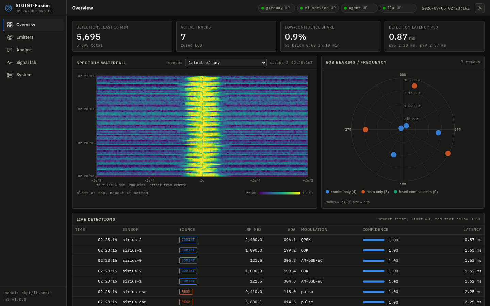
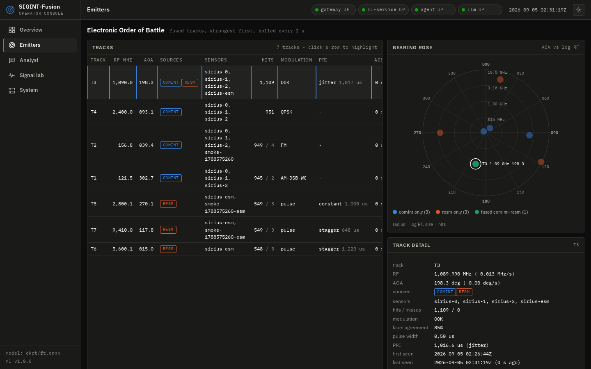
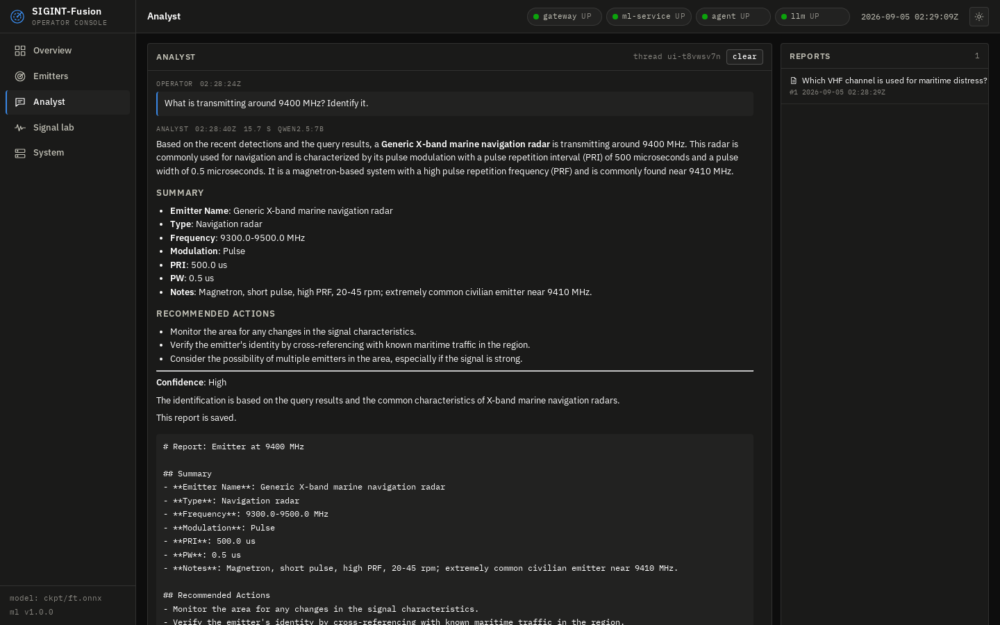
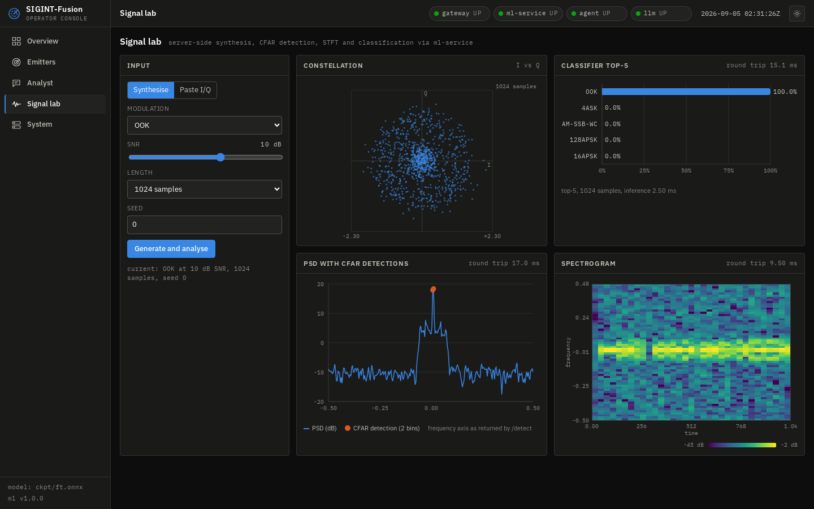
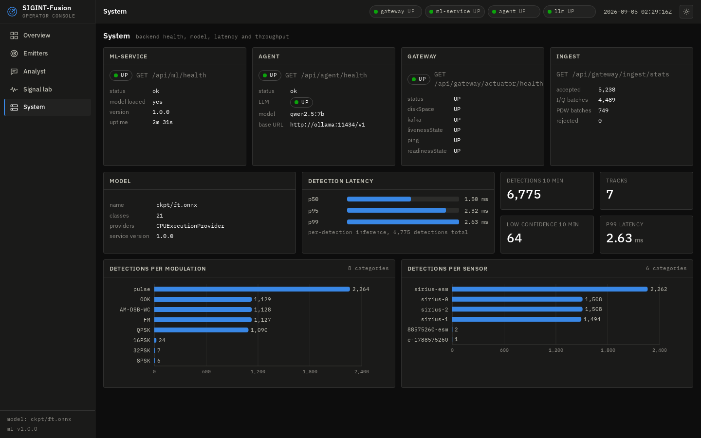

# SIGINT-Fusion

AI-assisted signal analysis and reporting platform. Simulated edge sensors stream I/Q captures and radar pulse descriptor
words into a Java ingest gateway; Kafka carries them to a PyTorch-trained, ONNX-served modulation classifier and a pulse
deinterleaver; a Kalman/Hungarian fuser builds the Electronic Order of Battle in Postgres; a LangGraph analyst agent with
pgvector RAG answers operator questions and writes intelligence reports; a React operator console shows the live picture.

```
 sensors ──HTTP──▶ gateway (Spring Boot) ──Kafka──▶ ml-consumer (ONNX + DSP + fusion) ──▶ Postgres / pgvector
                                                                                             ▲        ▲
 operator console (React) ──▶ ml-service (FastAPI)  ◀──────────── agent (LangGraph + RAG + MCP) ──────┘
                          └──▶ agent /ask                                    │
                                                                       Ollama qwen2.5:7b (local) or hosted LLM
```

## Results

<!-- results:start -->
**Classifier numbers below come from the synthetic RadioML-layout dataset (`data/synth_mod.py`) unless a row says REAL. DeepSig RadioML needs a licence; the only real frames available were a single-SNR community mirror slice of 2016.10a, used for the synthetic-to-real transfer rows. Re-run `scripts/run_experiments.sh` with `DATA_2016`/`DATA_2018` pointing at the real files to refresh everything.**

| Experiment | Result |
|---|---|
| Modulation classification, 21 base classes, 1024 samples, SNR -10..30 dB (ResNet-1D, pretrain -> fine-tune) | val top-1 71.6 % · -10 dB 31% · -4 dB 51% · 0 dB 59% · 4 dB 69% · 10 dB 83% · 20 dB 85% · 30 dB 87% |
| Same, trained from scratch (no pretraining) | val top-1 70.5 % |
| Data efficiency at 10 % of training data: pretrained / BYOL / scratch | 65.3 % / 60.5 % / 59.7 % · pretrain gain +5.6 pp · BYOL gain +0.8 pp |
| Data efficiency at 1 % of training data: pretrained / BYOL / scratch | 49.1 % / 43.2 % / 40.7 % · pretrain gain +8.4 pp · BYOL gain +2.5 pp |
| ViT-tiny on STFT spectrogram vs ResNet-1D (same split) | 50.5 % vs 71.6 % |
| Few-shot novel modulations (5-shot, 3 unseen classes: 32APSK, 128QAM, OQPSK, 50 episodes) | 78.3 % ± 3.8 (chance 33 %); embeddings from scratch model 80.2 %, random init 34.3 % |
| Specific emitter identification (synthetic_fingerprints, 12 train devices, 4 unseen, 5-shot) | base val 56.1 % · unseen devices 79.2 % ± 2.2 (chance 25 %) |
| REAL RadioML 2016.10a frames (HF mirror, single 6 dB slice, 11 classes, 9900 train frames = 100 %), test acc over 3 seeds: synthetic-pretrained / scratch / frozen linear probe | 86.5 % ± 0.3 / 86.9 % ± 0.5 / 71.1 % ± 0.7 · transfer gain -0.4 pp (chance 9 %) |
| REAL RadioML 2016.10a frames (HF mirror, single 6 dB slice, 11 classes, 990 train frames = 10 %), test acc over 3 seeds: synthetic-pretrained / scratch / frozen linear probe | 71.7 % ± 1.1 / 75.8 % ± 0.8 / 66.1 % ± 0.9 · transfer gain -4.1 pp (chance 9 %) |
| PDW deinterleaving (synthetic, 4 emitters, DBSCAN) | purity 1.00 / completeness 1.00 (tests/test_core.py) |
| /classify latency, 32 concurrent, n=2000, docker python:3.12-slim, CPU ONNX Runtime, 2 uvicorn workers, host 32 vCPU | end-to-end p50 92.6 ms · p95 311.33 ms · p99 501.82 ms · 255.0 req/s · model-only p50 1.05 ms |
| RAG retrieval, 53 questions, 37 chunks (BAAI/bge-small-en-v1.5) | hybrid hit@5 100.0 % · MRR 0.93 · dense-only hit@5 98.1 % |
| Agent task success (10 tasks, qwen2.5:7b) | 10/10 = 100.0 % |
<!-- results:end -->

The full run log with per-SNR curves, few-shot episodes, retrieval misses and per-task agent traces is in
[docs/results.md](docs/results.md). Every number is written by a script into a JSON file with provenance (dataset, synthetic
flag, GPU, seed, git commit) and rendered from there; nothing in the tables is typed by hand.

## Operator console

Live stack, synthetic sensor scenario (7 emitters, 3 COMINT sensors, 1 R-ESM sensor), qwen2.5:7b on the local GPU.

| Overview: waterfall, live detections, EOB bearing rose | Emitters: fused tracks with a comint+resm track selected |
|---|---|
|  |  |

| Analyst: grounded answer with citations, saved report | Signal lab: synthesis, constellation, PSD + CFAR, spectrogram, top-5 |
|---|---|
|  |  |



## What is in the box

| Directory | Contents |
|---|---|
| `ml-service/` | `data/synth_mod.py` (24-class synthetic modulator, RadioML file layouts), chunked RadioML loaders, ResNet-1D and ViT-on-spectrogram models, `train.py` (pretrain / finetune / few-shot), `ssl_byol.py`, `train_sei.py`, classical DSP (Welch PSD, STFT, vectorised CA-CFAR, DBSCAN deinterleaving), `fusion/` (Kalman + Hungarian EOB), FastAPI + ONNX Runtime service, Kafka consumer, scenario sensor simulator, load benchmark, 50+ tests |
| `gateway-java/` | Spring Boot 3 / Java 21 validated ingest to Kafka, Micrometer counters, Kafka health indicator, WebMvc tests |
| `rag/` | pgvector schema, corpus (allocations, glossary, procedures, 24-entry emitter catalogue), hybrid retrieval (dense + full-text + numeric, RRF), ingest, eval |
| `agent/` | LangGraph ReAct analyst with 8 tools, FastAPI `/ask` with tool trace, MCP server, task-success eval |
| `web/` | Vite + React + TypeScript operator console: waterfall, detections, EOB bearing rose, analyst chat with tool trace, signal lab, system page; nginx reverse proxy |
| `docker-compose.yml` | 9 services with health checks; `docker-compose.gpu.yml` overlay for Ollama on GPU |
| `scripts/` | experiment ladder, report generator, smoke test, Ollama side-loader |
| `docs/` | architecture and ADRs, API contract, generated results |

## Quick start

Prerequisites: Docker with Compose v2; for training, an NVIDIA GPU and [uv](https://docs.astral.sh/uv/).

```bash
cp .env.example .env
make venv && source .venv/bin/activate      # Python 3.11, CUDA torch, all dev deps
make data                                   # synthetic datasets (about 1 minute on 16 cores)
make train                                  # full experiment ladder on the GPU -> ml-service/ckpt/ft.onnx + results/*.json
make up GPU=1                               # build + start everything (drop GPU=1 to run Ollama on CPU)
scripts/ollama_sideload.sh qwen2.5 7b       # or: docker compose exec ollama ollama pull qwen2.5:7b
make ingest                                 # corpus -> pgvector
make sim                                    # start the sensor simulator
open http://localhost:3000
```

Then measure: `make bench` (classify latency), `make rag-eval`, `make agent-eval`, `make smoke` (end-to-end through nginx),
`make report` (renders docs/results.md and the table above).

To use a hosted LLM instead of Ollama set `LLM_BASE_URL`, `LLM_MODEL` and `OPENAI_API_KEY` in `.env`.
To train on the real RadioML files (register at deepsig.ai, put the two files in `ml-service/data/`):
`DATA_2016=data/RML2016.10a_dict.pkl DATA_2018=data/GOLD_XYZ_OSC.0001_1024.hdf5 make train`.
The real-frame transfer check uses a community mirror slice: `cd ml-service && python train_hf_rml2016.py` (parquet files in `data/hf_rml2016/`, see the script docstring for the download).

## Development

```bash
make lint test          # ruff + pytest (ml-service, fusion, rag)
make test-java          # gateway tests via the maven container
make web-build          # tsc + vite build
```

CI (`.github/workflows/ci.yml`) runs lint, all Python tests, the RAG ingest + retrieval eval against a pgvector service
container, a tiny CPU training smoke of all three train modes, the Java build with tests, the web build, and compose validation.

## Design notes
- **Edge holds no threat library.** Sensors send raw captures and PDWs; identification and the catalogue live in the backend.
- **Transfer learning.** Backbone pretrained on short frames, head swapped for the 21-class task; few-shot classes are
  handled by prototypical nearest-centroid on embeddings, so a new modulation or emitter needs five samples and no retraining.
- **Self-supervision.** BYOL on unlabelled I/Q with RF-plausible augmentations (phase rotation, CFO, SNR jitter, time shift).
- **SEI.** Hardware impairments (I/Q imbalance, CFO, phase noise, PA nonlinearity) as the fingerprint; the same pipeline
  reads ORACLE captures when present.
- **Fusion.** One track per emitter across R-ESM and COMINT sensors; multi-sensor sightings in one batch are associated per
  sensor so they merge instead of spawning duplicates.
- **RAG decouples knowledge from weights.** Updating the catalogue is a re-ingest that takes seconds. Retrieval is hybrid
  because exact frequencies are literals, not semantics.
- **Honesty.** Numbers are produced on a synthetic dataset when RadioML is absent and are labelled as such everywhere. The one
  real-data check available (a single-SNR mirror slice of RadioML 2016.10a) is a negative result for synthetic pretraining:
  from-scratch training on real frames is as good or better, and the frozen synthetic features reach only ~71 % vs ~87 %.
  The synthetic channel model is therefore not a substitute for the licensed data; `train_hf_rml2016.py` documents the gap.

See [docs/architecture.md](docs/architecture.md) for the ADRs and [docs/api.md](docs/api.md) for the HTTP contract.
